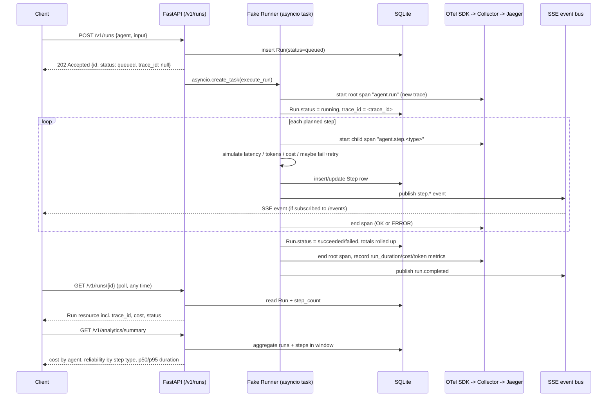

# StackAI Agent Runs API

A public HTTP API for starting and observing agent runs, backed by a seeded
fake runner and instrumented end-to-end with OpenTelemetry into a real
tracing backend (Jaeger, via a local OTel Collector - or Honeycomb/Grafana
Cloud with an env var change).

## Quickstart

Everything below was verified end-to-end on a clean checkout - dependency
install, test suite, live run, and a real trace pulled back out of Jaeger -
before this repo was pushed.

### Prerequisites

- Python 3.11+
- Docker Desktop (only needed for the local observability backend - the API
  itself runs fine without it, see "No Docker?" below)

### 1. Clone and enter the project

```bash
git clone https://github.com/Sonte0508/stackai-agent-runs.git
cd stackai-agent-runs
```

### 2. Start the observability backend (Jaeger + OTel Collector)

```bash
docker compose up -d
```

First run pulls two images (~150MB total), so it can take a minute. Verify
both are up:

```bash
docker compose ps
```

You should see `jaeger` and `otel-collector` both listed as `Up`.

### 3. Set up the Python app

**macOS / Linux:**

```bash
python3 -m venv .venv
source .venv/bin/activate
pip install -r requirements.txt
cp .env.example .env
uvicorn app.main:app --reload
```

**Windows (PowerShell):**

```powershell
python -m venv .venv
.venv\Scripts\Activate.ps1
pip install -r requirements.txt
copy .env.example .env
uvicorn app.main:app --reload
```

Leave this running - it's the API server, on http://localhost:8000.

### 4. Try it

- **Swagger docs**: http://localhost:8000/docs - the generated OpenAPI spec,
  browsable and directly "Try it out"-able.
- **Dashboard**: http://localhost:8000/ - has a "start a run" button plus
  live cost/latency/reliability stats (refreshes every 5s).
- **Jaeger UI**: http://localhost:16686 - pick service `stackai-agent-runs`,
  click "Find Traces".
- **Health check**: `curl http://localhost:8000/health`

### 5. Start a run and follow it into the trace backend

```bash
curl -X POST http://localhost:8000/v1/runs \
  -H "Content-Type: application/json" \
  -d '{"agent": "research-assistant", "input": {"query": "Summarize Q2 churn drivers"}}'
```

This returns `202` immediately with the run's `id` (status `queued` - the
run executes in the background). Poll it:

```bash
curl http://localhost:8000/v1/runs/<id>
```

Once `status` is `succeeded` or `failed`, the response includes a
`trace_id` - paste that into Jaeger's search box (or
`http://localhost:16686/trace/<trace_id>` directly) to see every step,
its timing, tokens, and cost, plus the retry/failure trail if one happened.
`GET /v1/runs/<id>/steps` shows the same data as a plain API resource, and
`GET /v1/analytics/summary` rolls it up across all runs.

### 6. Run the tests

```bash
pytest
```

### No Docker?

The app still runs and works fully - trace/metric exports just fail
silently in the background (logged, not fatal) until a collector is
listening on `OTEL_EXPORTER_OTLP_ENDPOINT`. Everything except "look at the
trace in Jaeger" still works: creating runs, polling, steps, analytics,
the dashboard.

### Pointing at a hosted backend instead of local Jaeger

Edit `.env`:

```
OTEL_EXPORTER_OTLP_ENDPOINT=https://api.honeycomb.io
OTEL_EXPORTER_OTLP_HEADERS=x-honeycomb-team=YOUR_API_KEY
```

(Grafana Cloud/Tempo works the same way - see the commented-out example in
`.env.example`.)

---

## 1. What I built, and what I cut

**Baseline (both required, both built):**
- Versioned public API (`/v1/...`) with a generated OpenAPI spec, RFC7807-style
  error contract, and pagination/filtering on list endpoints.
- Full tracing: every run is a root trace with one child span per step
  (plus two synthetic child spans under `sub_agent` steps, to show what a
  nested delegation would look like in the trace tree), tagged with
  `gen_ai.*` attributes on model-call spans.

**Picked two extra features (brief asked for at least one):**
- **Long-running runs done right** - `POST /runs` returns `202` immediately;
  callers can poll `GET /runs/{id}`, or stream `GET /runs/{id}/events`
  (SSE) and get step-by-step progress live, with backlog replay for late
  subscribers.
- **Cost and token accounting** - every step and run tracks tokens and cost
  from one shared pricing table (`app/services/cost.py`), rolled up into
  `GET /analytics/summary` (cost by agent, reliability/latency by step
  type, p50/p95 run duration) and `GET /analytics/runs/{id}/cost` (per-step
  breakdown for one run).

**Small optional extensions I also built, because they were cheap given the
above:**
- Idempotency keys on `POST /runs` (replay the same run on retry instead of
  double-starting it; `409` if the same key is reused with a different body).
- Run cancellation (`POST /runs/{id}/cancel`) and its effect on the trace -
  the root span ends with status `cancelled`, and no further step spans open.

**Cut, deliberately:**
- **Webhooks, rate limiting, batch API, audit trail.** All four are listed
  as legitimate picks in the brief; I chose depth on two features over
  breadth across six. Webhooks in particular would have been a natural
  complement to SSE (push vs. pull) but felt like a second multi-hour slice
  on its own (delivery guarantees, signing, retries with backoff, a
  `deliveries` sub-resource) rather than something to bolt on in the time
  left.
- **Multi-instance event bus.** The SSE fan-out (`app/services/pubsub.py`)
  is in-process (`asyncio.Queue` per subscriber). Fine for one process; a
  real deployment behind multiple app instances would need Redis pub/sub or
  Postgres `LISTEN/NOTIFY` instead. Steps are still persisted regardless, so
  polling always works even without the live stream.
- **A real model / agent framework.** Per the brief, the runner is fully
  simulated (seeded RNG for step plan, latency, tokens, and failures) - the
  point was the API and observability around it, not agent orchestration.
- **ETag / conditional GET, exemplars, sampling strategy.** Reasonable next
  additions, not built.

---

## 2. Key decisions

### API contract
- **Versioned by URL path** (`/v1`), not header - easier for a developer to
  see at a glance and to `curl` directly. A `v2` would live alongside `v1`
  as a new router; nothing about the current shape assumes it's the only
  version that will ever exist.
- **`POST /runs` returns `202 Accepted`, not `201 Created`** - a run isn't
  "created" in a REST-resource sense so much as *kicked off*; 202 is the
  more honest signal that the work is still in flight, which is also the
  first thing a developer needs to know to write correct client code (don't
  assume `output` is populated on the response you got back).
- **Idempotency-Key is opt-in via header**, not a body field, following the
  Stripe/OpenAI convention developers already know. Same body + same key
  replays the original run; same key + different body is a `409`, not a
  silent overwrite.
- **Errors are `application/problem+json`** (RFC 7807) with a stable `code`
  for programmatic branching, separate from the human-readable `title`/
  `detail`, plus a `request_id` that also appears in the matching trace
  (see below) so a support conversation can go straight from an error
  response to the exact trace that produced it.
- **Cursor pagination**, not offset - opaque base64 cursor over
  `created_at`, so results stay stable even as new runs are created between
  page fetches.

### Observability model
- **One trace per run, root span with no parent.** A run outlives the HTTP
  request that started it, so its span can't be a child of the request
  span (that span closes when the `202` is returned, long before the run
  finishes) - it's given its own root context via `execute_run()`. The
  inbound `POST /runs` request gets its own short span from the FastAPI
  auto-instrumentation, and the two are linked via `trace_id` on the `Run`
  resource, not via a parent/child span relationship.
- **One child span per step**, named `agent.step.<type>`, carrying
  `stackai.step.*` attributes plus `gen_ai.*` attributes (request model,
  input/output token counts) on model-call steps specifically, since that's
  the emerging OTel semantic-convention shape a few backends already
  understand natively.
- **A step is also a first-class stored resource**, not just a span. Spans
  answer "what happened, in order, with timing" inside the trace UI;
  `Step` rows in the DB answer "what happened" for the *API* (`GET
  /runs/{id}/steps`) and are what the SSE stream and analytics roll-ups
  are built from. Keeping both meant the trace didn't have to be the only
  place a developer could inspect a run - useful for anyone without direct
  Jaeger/Honeycomb access.
- **Metrics are separate from spans**, not derived from them:
  `agent_run_duration_ms` (histogram), `agent_run_total` (counter, by
  status), `agent_cost_usd_total`, `agent_tokens_total`, and
  `agent_step_retry_total`. These are what `/analytics/summary` re-derives
  independently from the DB (not from the metrics backend) - the two should
  agree, and in the demo I show both.

### Cost model
- One pricing table (`app/services/cost.py`), three simulated model tiers
  (`sim-fast` / `sim-standard` / `sim-reasoning`) with distinct input/output
  per-1K pricing, plus a flat per-call cost for tool calls. Every place that
  reports cost - the `Run` resource, the per-run breakdown, and the
  aggregate summary - reads from the same step-level numbers, so there's
  exactly one source of truth instead of three slightly-different
  recomputations.
- Analytics report **p50 and p95 run duration, not just an average** -
  an average silently hides the slow tail, which is usually the actual
  thing someone opening a cost/latency dashboard is trying to find.

### What I'm least sure about
- **Retry semantics on failure.** Right now a step that exhausts its
  retries fails the *entire* run - no partial success, no "best effort"
  output. That's simple and matches how I'd want a debugging session to
  read ("this run failed, here's exactly which step and why"), but a real
  agent platform might want per-step failure isolation (let sibling tool
  calls finish, then fail with partial output) or configurable
  failure-handling policy per agent. I picked the simpler model to keep the
  trace and the state machine easy to reason about, and I'd want customer
  input before building the more complex version.
- **In-process SSE + background tasks.** This is the one architectural
  choice that doesn't survive a second app instance or a restart mid-run
  (see cuts, above). I'm fairly confident it's the right cut *for this
  exercise*, but it's the one piece of the design I'd actually change first
  if this were going to production tomorrow.
- **Cancellation is genuinely best-effort, and I only partially closed the
  gap.** The runner only checks the cancel flag *between* steps, so a run
  whose steps are individually fast (the default demo speed factor makes
  each step tens of milliseconds) can finish entirely before a cancel
  request even lands - I confirmed this by calling cancel immediately after
  create and getting back `cancelling`, then watching the run resolve to
  `succeeded` moments later. I added one hardening check (re-test the flag
  right after the step loop, before deciding the final status) that closes
  the specific window where cancellation arrives while the last step is
  still finishing, but it does not close the earlier window between
  `POST /runs` returning `202` and the background task's first line
  actually executing. A caller has no way to distinguish "cancellation will
  take effect" from "it arrived too late and will be silently ignored" -
  `cancelling` is not a reliable predictor of `cancelled`. I'd want to make
  that explicit in the API docs (or accept only a narrower cancellation
  guarantee) before calling this "done."

---

## 3. One run, sketched



---

## 4. AI usage

I used AI (Claude) to scaffold this, as invited by the brief. Roughly:

- **Where it helped:** generating the FastAPI/SQLAlchemy/Pydantic boilerplate
  (models, repository, schemas, routers) quickly once the API contract and
  trace model were decided; writing the OTel Collector config; drafting the
  first pass of this README from the actual code.
- **Where it was wrong, and how I caught it:** the first version imported
  the metric instruments (`token_counter`, `cost_counter`, etc.) with
  `from app.telemetry import token_counter`, which binds a `None` at import
  time - before `setup_telemetry()` runs and actually creates the
  instruments - so every metric call crashed with `AttributeError` the
  moment a run executed. I caught it by actually running the test suite and
  a live run end-to-end rather than trusting that it looked right; fixed by
  referencing `telemetry.token_counter` at call time instead of importing
  the name directly. Two more real bugs turned up the same way: a
  freshly-constructed retry `StepRecord` had `None` token/cost fields
  because SQLAlchemy's column defaults only apply at INSERT time, not at
  object construction, which broke the "update existing step" path on a
  retry; and an initial `StaticPool` SQLAlchemy engine config (meant to
  share one connection, which is only correct for `:memory:` SQLite)
  caused real transaction interleaving bugs under concurrent runs against
  the file-based DB, surfacing as intermittent `StaleDataError`s - fixed by
  switching to WAL mode with normal per-session connections instead.
- **Two more bugs found on a second review pass, again by actually exercising
  the running app rather than reading the diff:** the pinned
  `opentelemetry-instrumentation-fastapi==0.48b0` (and matching `1.27.0`
  api/sdk/exporter) transitively needs `pkg_resources`, which isn't present
  in a plain `pip install -r requirements.txt` on a current Python/pip/
  setuptools toolchain - the app failed to even import, before a single line
  of application code ran. Fixed by bumping the whole OTel stack to
  `1.43.0` / `0.64b0`, which uses `importlib.metadata` instead and has no
  such dependency; verified with a clean venv. Separately, the
  Idempotency-Key check-then-insert in `create_run` had a real race: nothing
  below the service-layer check stopped two concurrent requests with the
  same key from both passing it and both inserting a run - the exact
  scenario idempotency keys exist to prevent (a client retrying after a
  timeout while the first attempt is still in flight). Reproduced it by
  firing 5 concurrent identical requests with the same key: got 2 different
  run ids back and 3 `500`s (`MultipleResultsFound`, since a second row with
  the same key made every future lookup on that key error instead of
  returning one row). Fixed with a DB-level `UniqueConstraint("agent",
  "idempotency_key")` plus an `IntegrityError` fallback in the service that
  replays the winner's run instead of raising - re-ran the same 5 concurrent
  requests afterward and got one run id and five `202`s, no errors.
- I did not hand-roll the OTel SDK, FastAPI, or SQLAlchemy internals - per
  the brief, I leaned on the libraries and focused review time on the
  parts specific to this domain: the trace/step model, the retry and
  cancellation state machine, and the cost rollups.

---

## Project layout

```
app/
  main.py              FastAPI app, telemetry setup, error handlers
  config.py            Settings (env-driven)
  telemetry.py         OTel tracer/meter setup, metric instruments
  api/v1/              Route handlers (thin - delegate to services)
  services/
    run_service.py     Run lifecycle: create / get / list / cancel
    runner.py           The fake agent runner + OTel spans per step
    analytics_service.py  Aggregation for /analytics/summary
    cost.py             Single source of truth for pricing
    pubsub.py            In-process SSE fan-out
  db/                  SQLAlchemy models, session, repository (persistence
                        isolated from services/API per the code standards)
  schemas/             Pydantic models = the public API contract
  core/errors.py       RFC7807 error types + handlers
static/dashboard.html  Analytics dashboard + "start a run" button
otel/                  OTel Collector config (OTLP in -> Jaeger + Prometheus)
tests/                 API-level integration tests (httpx + ASGI transport)
```
